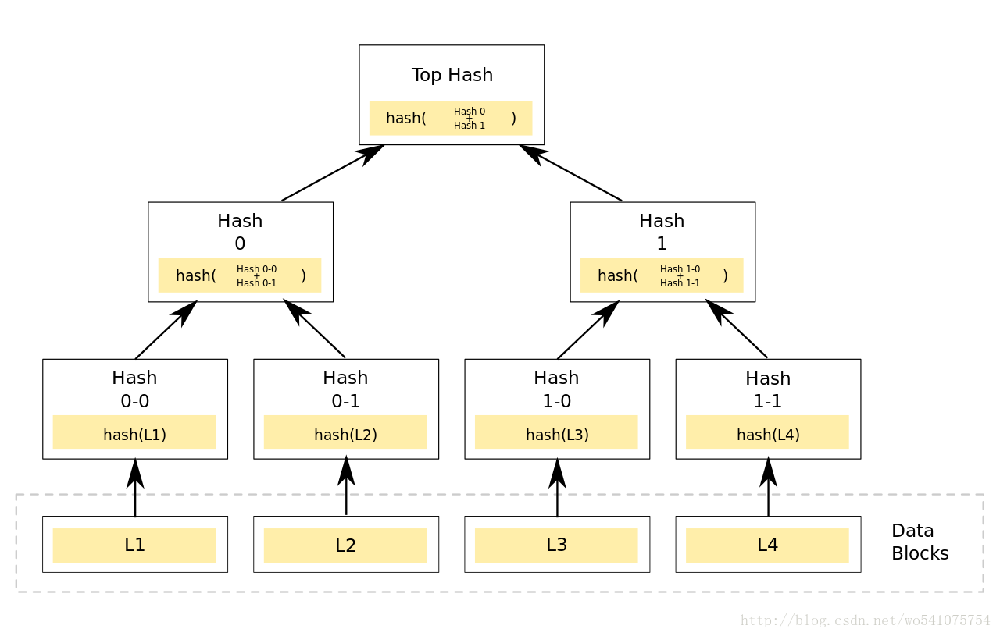
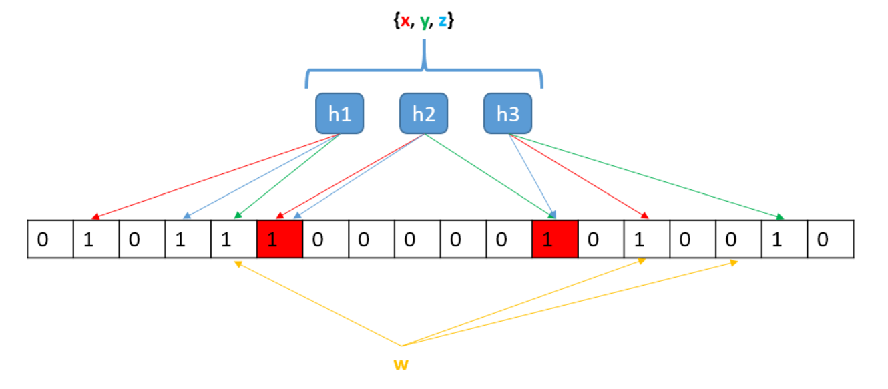
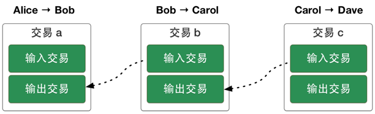
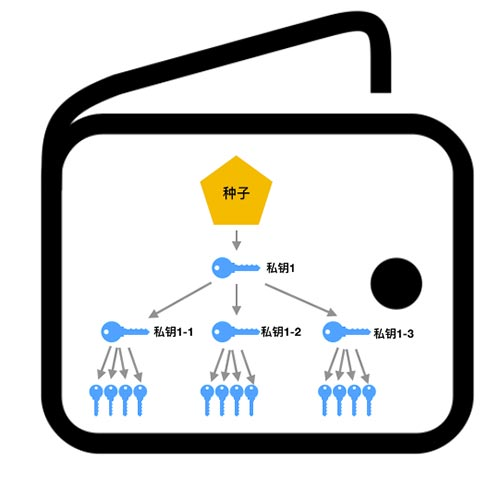

# bitcoin 杂记

1. ## 术语
   * SPV(Simplified Payment Verification) 简易支付验证
   * Merkle Tree(默克尔树)
   * Script(脚本)
   * BIP39/BIP44(HD，分层钱包)
   * bloom filter(布隆过滤器)
   * double spend(双花)
   * UTXO(未花费交易支出))

2. ## SPV钱包
   我们已经知道[bitcoinj][bitcoinj]是一个实现了bitcoin SPV模式的钱包，一般来说，做为数字资产的管理工具，钱包主要实现如下功能：
   * 如何知道自己有多少钱？
   * 防止双花(同一笔钱花费2次或以上)

   对于如何得知自己有多少钱，一般的方式是同步整个链上数据(Full Node)，再在本地进行计算。这种方式是没问题，不过随着链上数据的增长，动辙上百G，这对用户的磁盘和带宽显然会带来较大的压力，在一些资源受限的设备(如手机等)是无法工作的，而且同步的数据大部分与自己无关，更是造成了大大的浪费。SPV模式是仅下载块头(80字节)，无须下载所有块数据，再加上Merkle Tree和Bloom Filter技术，仅下载与钱包地址相关的交易，大大缩小了对磁盘，带宽和计算性能的要求，使得在手机等资源受限的设备上也可以工作，Bitcoinj正是实现了这一模式的钱包。

3. ## Merkle Tree
   默克尔树是一种二叉树，又称Hash树，其最底层叶子节点存储是Hash，相邻的2个叶子节点组合之后的Hash值做为上一层节点，依此类推，直至根节点（Merkle Root），区块链中使用默克尔树可以对块中包含的交易数据进行快速验证。众所周知，对数据稍作修改，都会引起hash结果的巨大变化，这种方式非常适合验证数据有没有损坏，缺失。

   

4. ## Bloom Filter
   布隆过滤是一种数学工具，在垃圾邮件过滤，爬虫等场景中大量使用。这里使用垃圾邮件场景说明一个其主要原理：
   在典型的垃圾邮件过滤场景中，需要存储一个列表，其中列出了需要过滤的垃圾邮件地址，对于163/google这种级别的邮件服务来说，这个列表会很大。  
   布隆过滤实际上是一个很长的二进制向量和一系列随机映射函数。假定我们存储一亿个电子邮件地址，我们先建立一个十六亿二进制（比特），即两亿字节的向量，然后将这十六亿个二进制全部设置为零。对于每一个电子邮件地址 X，我们用八个不同的随机数产生器（F1,F2, ...,F8） 产生八个信息指纹（f1, f2, ..., f8）。再用一个随机数产生器 G 把这八个信息指纹映射到 1 到十六亿中的八个自然数 g1, g2, ...,g8。现在我们把这八个位置的二进制全部设置为一。当我们对这一亿个 email 地址都进行这样的处理后，一个针对这些 email 地址的布隆过滤器就建成了。  
   相比于典型场景，布隆过滤器大大降低了对磁盘或内存的需求。在SPV钱包中，钱包通过布隆过滤器只下载自己关心的交易数据，而过滤掉无关的数据，大大节省了磁盘，带宽和计算资源。

   

5. ## UTXO
   UTXO(未花费交易支出)就是比特币中的钱，不同于以太坊中或传统的账户系统，传统场景中，A转给B一笔钱，需要减少A的账户余额，增加B的账户余额，这个过程中涉及到2个操作，且不能中途出错。UTXO是一种交易凭证，这个凭证可以在不同的比特币地址之间流转(价值转移))，同一个地址可以收到多UTXO，但他们不能合并（类似余额的概念），在花费它们的时候，需要一一引用。

6. ## script
   上面提到了UTXO的流转，那UTXO到底是怎么流转的呢？这里涉及到比特币的脚本系统，在每个交易中，主要分为2个部分，交易输入和交易输出，见下图

   

   其中交易输出即为UTXO，可以看到输出由输入而来，而输入又引用到另一个交易的输出，一个交易要完成的主要任务是将UTXO从输入地址转移到输出地址中，即完成价值转移过程，这个过程可以理解为如下过程：

   1. 上图的三个交易都是单输入单输出交易
   2. 每个『输入交易』『输出交易』中，都包含对应的『脚本』
   3. 交易a，Alice转账给Bob；交易b，Bob转账给Carol；交易c，Carol转账给Dave
   4. 当前交易的『输入』都引用前一个交易的『输出』，如交易b的『输入』引用交易a的『输出』

   交易a中的『输出脚本』就是Alice为Bob出的数学题。那么，Bob想要引用交易a『输出交易』的比特币，就要解开这道数学题。题解是在交易b的『输入脚本』里给出的！Bob解开了这道题，获得了奖金，然后在交易b中为Carol出一道数学题，等待Carol来解...

7. ## HD/BIP44
   HD钱包不是硬件钱包(Hardware Wallet)，而是指分层确定性钱包(Hierarchical Deterministic)，为什么要使用分层钱包，这是为了方便地址的管理，现在加密货币种类太多，每种还有多个地址，地址又没什么规律性，不方便记忆和管理，出于减少加密货币资产管理麻烦的需要，BIP39/44系列方案应运而生，用户仅需要记忆12~24个单词(种子)，就可以管理包含多种加密货币的的多个地址，如下国所示：

   

8. ## 参考资源
   * [理解比特币脚本][script]
   * [数字钱包地址生成][bip39]
   * [BIP44规范][bip44]
   * [分级钱包][hd]
   * [bitconj官网][bitcoinj]
   * [圖文詳解哈希樹-Merkle Tree（默克爾樹）算法解析][merkle]
   * [简易支付验证能支持数十亿的比特币用户吗?][spv]
   * [布隆过滤器（Bloom Filter）][bloom]
   * [Create And Sign Bitcoin Transactions With Golang][sign]
   * [其实并没有什么比特币，只有 UTXO][utxo]

[spv]:https://lilymoana.github.io/SPV.html
[script]:https://www.8btc.com/article/38515
[bip39]:https://iancoleman.io/bip39/
[bip44]:https://github.com/bitcoin/bips/blob/master/bip-0044.mediawiki
[hd]:https://zhuanlan.zhihu.com/p/30297080
[bitcoinj]:https://bitcoinj.github.io/
[merkle]:http://www.itread01.com/articles/1487247623.html
[bloom]:https://china.googleblog.com/2007/07/bloom-filter_7469.html
[sign]:https://www.thepolyglotdeveloper.com/2018/03/create-sign-bitcoin-transactions-golang/
[utxo]:http://www.aetino.com/aetino_Product_1999854668.html