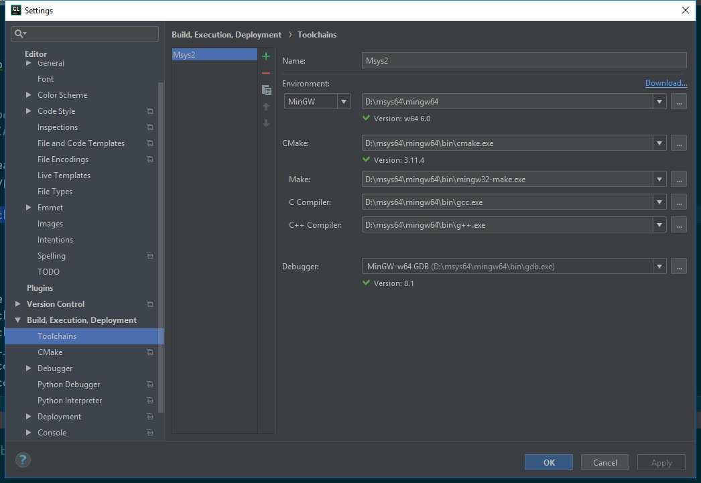
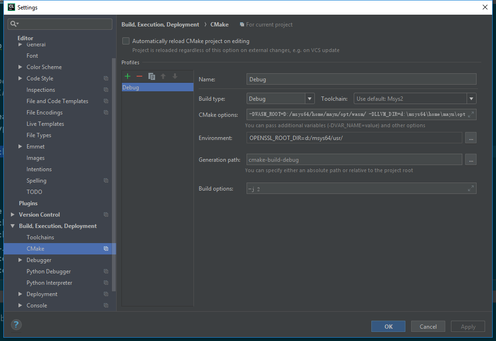

# eos code navigate

1. ## 背景
   一直想要阅读[EOS][eos]源码，尝试过各种工具，在这里记录一下过程，以防忘记。

2. ## 环境
   这里先说一下环境，因办公需要，这里使用Windows作为主系统，用Mac的同学可以不用往下看了。相信用惯了Mac和Linux的同学已经大概猜到使用Windows作为开发环境的痛苦了。
   一般来说，开发都会使用虚拟机(VM)或是远程Linux服务器。这里的问题是，想阅读EOS的源码：用哪种方案好？参考方案有：
   * Clion + Msys2
   * VM/Continer + Clion + VNC/X Forward
   * VS/Vscode
   * Emacs

3. ## Clion + Msys2
   这里选择了Clion + Msys2方案，说说原因。
   * VS远比Clion复杂，
   * vscode功能过于简单，函数的定义跳转比较弱
   * VM方式，过程复杂，VNC/X Forward效率低且界面不好看

   优点：
   * 不用VM/容器，仅Windows环境，配置，使用相对简单

   缺点：
   * Clion占用内存相当大，建议不要与其他占内存应用同时开启

4. ## 过程
   关键思路，Clion非常适合管理Cmake项目，恰恰EOS项目需要依赖一些库/工具，所以需要在Msys2环境里安装这些依赖，且指定Clion使用相应的库/工具，依赖库有：
   * Cmake
   * Boost
   * openssl
   * secp256k1
   * llvm for wasm

   如何安装这些依赖，可以参考eos源码目录中的scripts/eosio_build_centos.sh，可以在Msys2环境中手工编译，我这里稍微偷了下懒，只有secp256k1和llvm是手工编译的，Cmake, openssl和Boost使用Msys2自带的pacman包管理工具安装即可。

5. ## Clion配置，
   * 编译环境(Msys2)

   

   * Cmake(相关依赖)

   

   其中通过-D方式(或环境变量)指定WASM安装路径和LLVM Cmake配置文件位置

   ```js
    -DWASM_ROOT=D:/msys64/home/mayn/opt/wasm/
    -DLLVM_DIR=d:/msys64/home/mayn/opt/wasm/lib/cmake/llvm/ 
    -DOPENSSL_ROOT_DIR=d:/msys64/usr/
   ```

6. ## 总结
   看到这里，就可以在Windows上使用Clion + msys2来查看EOS项目的源码了，虽然过程曲折，但这是值得的，好的工具，好的体验会大大提高源码阅读的效率。当然，Clion本身占用内存太大是个问题，在我的机器上，8G内存还有点紧张。看看以后能不能研究一下emacs。

7. ## 参考资源
   * [eos源码][eos]
   * [msys2官网][msys2]

[eos]:https://github.com/EOSIO/eos
[msys2]:https://www.msys2.org/
