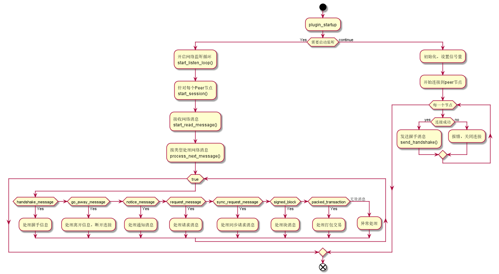
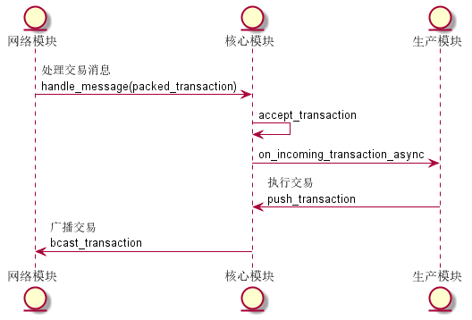
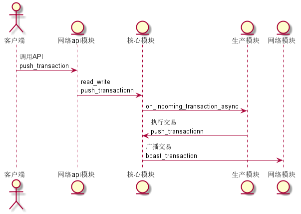
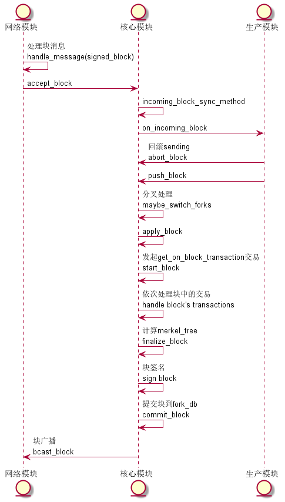
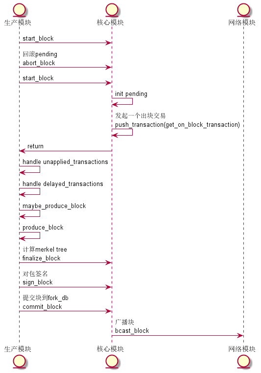

# EOS网络与其它模块交互分析

1. ## 模块概述
   EOS的每个节点都对等的P2P节点，每个节点既是交易/块的接收者，也是交易/块的广播者。网络模块在节点之间负责底层的实现，如网络的连接/关闭，消息的接受、发送和广播，以及与其他模块，如producer_plugin和chain_plugin的交互等。
2. ## 主要流程
   

   要点解析：从上面的流程图可以看出，网络模块的主要逻辑分为2个部分：
   * 左边，循环接收网络消息，按类型分别处理消息。
   * 右边，网络初始化，如连接P2P节点，发送握手消息等

3. ## 交互协议
   交互协议分为：  
   节点间交互(对外表现为处理不同的消息)和与其他模块之间的交互(模块函数的相互触发调用)
    主要消息类型及处理流程：
    * handshake, 节点自身情况通报，节点在处理handshake消息时要经历一系列的检查，最终才能互相确认的节点
    * packed_transaction, 交易处理分2种情况：
        * 从其他节点广播过来的交易，节点在收到包装好的交易后，先做一些检查，如果没有问题，则在本节点执行交易，修改世界状态(world-state)，交易的原始数据会放入pending中，等待打包，见下图：

        

        * 通过http接口传入的交易，处理过程与接收广播交易类似，见下图：

        

    * signed_block, 块处理也分2种情况：
        * 从其他节点广播的块：先将pending里的交易数据放入unapplied_transaction数据，重设pendig，这将导致pending的回滚, world-state回归原样。 再将块中的交易依次取出/执行，执行完成的块补放入本地临时数据库(fork_db)，只有最终块被确认不可逆，才会写入文件(db)中永久保存。

        

        上图中有个地方需要注意：maybe_switch_forks，这里是对分叉的情况进行处理，主要逻辑是进行分支切换，切换的过程是：
            * 找到2个分支的共同祖先块，在第1个分支上回滚到祖先块
            * 再依次应用第2个分支的块，直到第2个分支上的最新块

        * 自己产生的块：先将pending里的交易数据放入unapplied_transactions数据，重设pendig，这将导致pending的回滚, world-state回归原样。首先发起一个"get_on_block_transaction"这个交易逻辑由系统智能合约实现，主要实现出块奖励或重选出块节点。再依次处理unapplied_transactions和delayed_transactions中交易，接着再计算merkey_tree，提交包到fork_db, 等着包被确认，见下图：

        

    * request/sync_request/notify
        除此以外的其他网络消息，如request/sync_request/notify消息，大致可以理解对transaction/block消息的封装，主要用于同步交易和块，理解前面的过程，对这些消息也就不难理解了。

4. ## 总结
   eos中network_plugin, producer_plugin, chain_plugin之间的联系比较紧密，往往是你中有我，我中有你，需要结合起来进行理解。本文给出了EOS网络模块与其他模块之间进行交互的一个骨架，希望对大家阅读、理解EOS原理有所帮助。

5. ## 参考资料
   * [eos原力技术blog][eosforce]
   * [原创| 源码解析 producer_plugin 之区块的生产流程][eoslive]

[eosforce]:https://eosforce.io/blog/index.html#/cn/
[eoslive]:https://eos.live/detail/15375