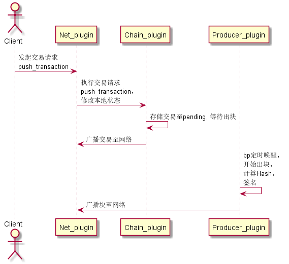
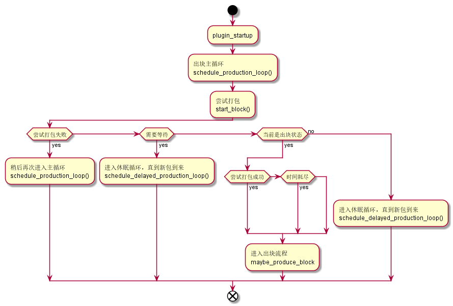
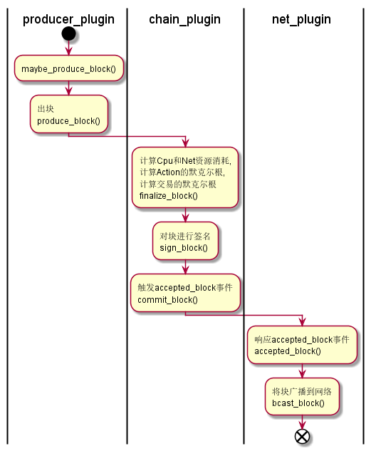

# EOS出块流程分析一

1. ## 背景
   本文参考了[EOS原力的Blog][blog]中的[Block Produce](https://eosforce.io/blog/index.html#/cn/blog_id=1)篇, 结合[eos源码][eos]-1.2.5版，对eos出块过程作了一点梳理。

2. ## 关键结构
   * 等待打包数据(libraries/chain/controller.cpp:74)

   ```C++
   struct pending_state {
        pending_state( maybe_session&& s )
        :_db_session( move(s) ){}

        maybe_session                      _db_session;

        block_state_ptr                    _pending_block_state;

        vector<action_receipt>             _actions;

        controller::block_status           _block_status = controller::block_status::incomplete;

        void push() {
            _db_session.push();
        }
    };
   ```

   * 控制器结构体(libraries/chain/controller.cpp:91)
   Controller.cpp这个类非常重要，相当于MVC框架中的C，它负责与各个组件进行交互，是Chain_plugin的主要实现。

   ```C++
   struct controller_impl {
      controller&                    self;
      chainbase::database            db;
      chainbase::database            reversible_blocks;
      block_log                      blog;
      optional<pending_state>        pending;  // 存储待打包数据
      block_state_ptr                head;
      fork_database                  fork_db;
      wasm_interface                 wasmif;
      resource_limits_manager        resource_limits;
      authorization_manager          authorization;
      controller::config             conf;
      chain_id_type                  chain_id;
      bool                           replaying= false;
      optional<fc::time_point>       replay_head_time;
      db_read_mode                   read_mode = db_read_mode::SPECULATIVE;
      bool                           in_trx_requiring_checks = false;
      optional<fc::microseconds>     subjective_cpu_leeway;
      ......
   ```

3. ## 流程概述
   从抽象层面看来，大致流程如下：

   * 客户端向节点发起交易(Push_transaction)
   * 节点中的网络模块(Net_plugin)接受到请求后，对交易本身作一系列的检查，然后对交易执行计算，这会影响到本节点状态(world_state)
   * 交易本身被存储到节点的Pending中，等待打包
   * 交易本身被广播到网络中
   * 节点中的出块模块(Producer_plugin)被定时器激活，执行打包过程，计算Hash，签名，广播块到网络中，这一系列过程称为出块  
   

   这里看一下出块模块的流程图：
   * schedule_production_loop  
   

   * maybe_produce_block  
   

4. ## 区块链的数据存储
   同数据库(DB)的概念类似，区块链和DB都有2部分数据：

   * 当前状态/最新状态数据
   * 历史操作数据

   它们的关系是：

   * 当前状态是在原始状态上按序执行历史操作，一步一步计算得出来的(这个操作叫重放)。
   * 当前状态可以反向执行历史操作序列回到原始状态(这个操作叫回滚)。

   简单举个例子，在一个存储帐户余额的系统中，最初A、B两个帐户余额都为0，假设发生如下的一系列操作：

   * 事件1: A获得奖励100，现在的当前状态是A(100)，B(0)
   * 事件2: A从自己账户转给B账户50，现在的当前状态是A(50)，B(50)
   * 事件3: B从自己账户转给A帐户25，现在的当前状态是A(75)，B(25)
   * ......  

   在上面的这个例子中，DB里有个地方是用来存储当前状态的，同时有另外一个地方来存储操作日志，即事件序列，每个事件记录什么时间发生了什么事。在DB分布式系统解决方案中，也是通过同步操作日志(事件序列)到其他节点上，其他节点再通过重放来建立当前状态，以达到多节点同步的目的，区块链与之概念非常相似。

   * 账本，即事件序列，区块链网络上的各节点只需要同步这个账本，再在本地重放即可达到与其他节点同步的目的。当然，在区块链的多节点环境中(多节点)，必须要保证账本的统一，即事件序列的统一，这点很重要。这也是共识算法的作用，只有大家一致认同的事件才可以上链。

5. ## 参考资料
   * [EOS原力的Blog][blog]
   * [eos源码][eos]

[blog]:https://eosforce.io/blog/index.html#/cn
[eos]:https://github.com/EOSIO/eos